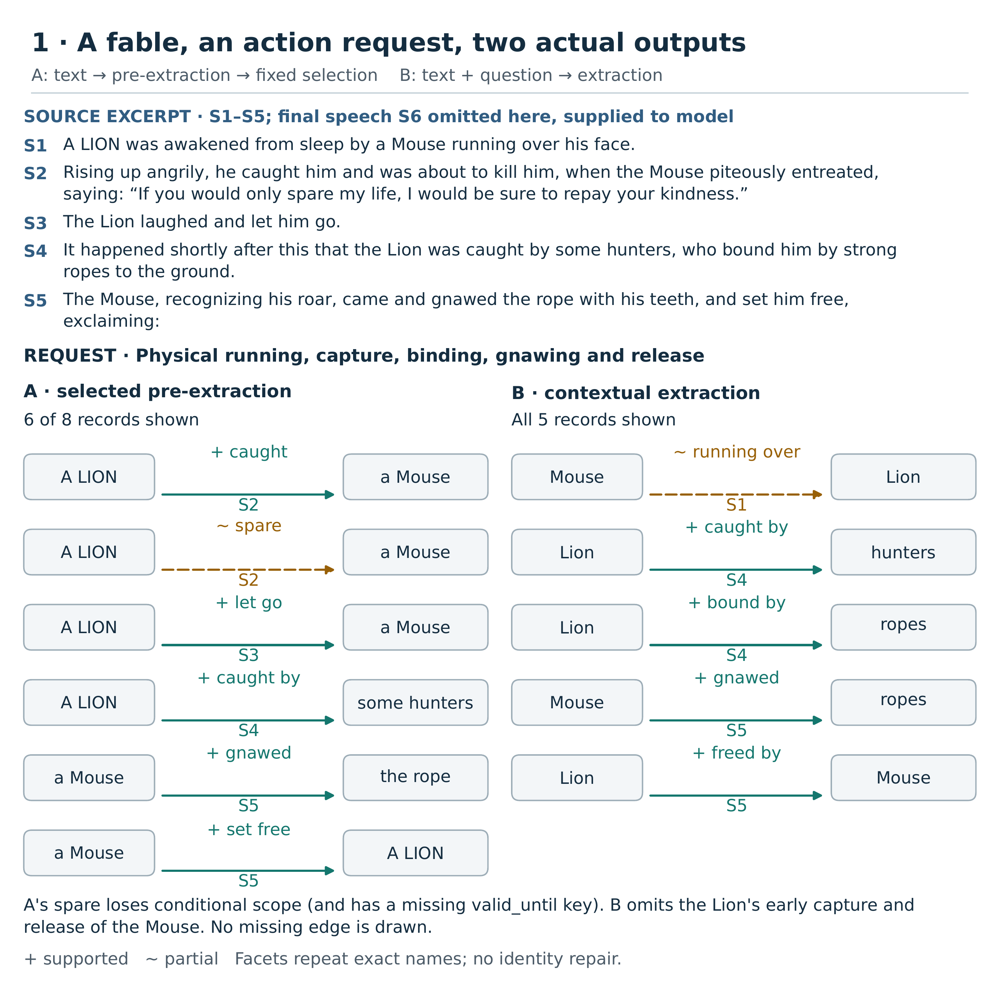
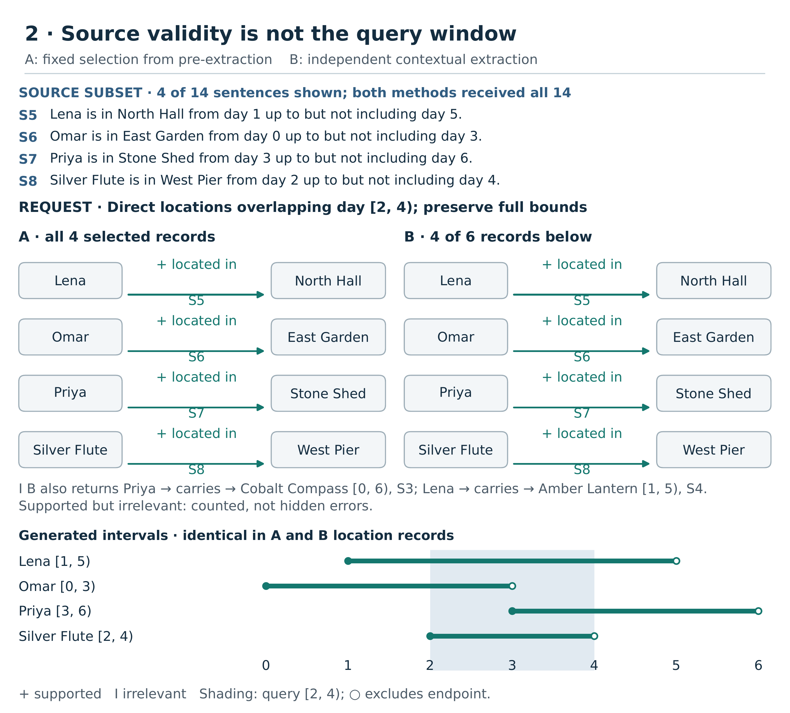
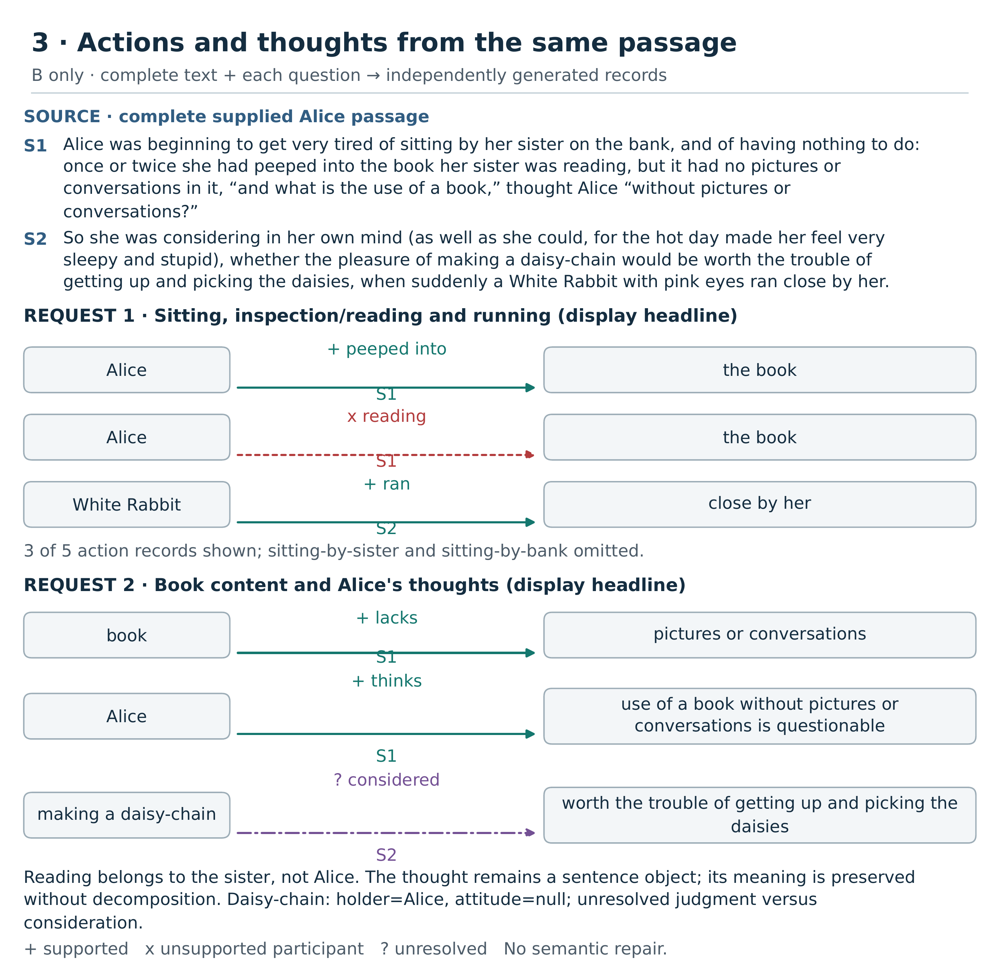

# Inspectable Narrative Graphs: An Exploratory Extraction Prototype

a.v.mantzaris

## Abstract

Narrative readers need different views of the same text: who carries an object, where participants are located, or what somebody believes rather than what the narrator states. We present an exploratory prototype that extracts compact, evidence-linked graphs and makes both useful information and errors inspectable. We compare query-blind extraction followed by fixed selection (A) with independent, direct contextual extraction (B). Two simple diagnostic ladders provide development context; the main evaluation uses three short synthetic stories and three published narrative passages. References and semantic assessments are Codex-authored. The corrected story batch produced 12 parseable outputs from 12 calls. Fixed selection achieved perfect strict qualified-fact agreement on every ownership/possession and interval-location view, whereas contextual answers retained irrelevant facts. On the fable action question, strict F1 was 0.625 for A and 0.308 for B. Alice's contextual claims answer preserved 3 of 4 semantic targets despite zero strict F1. Published-prose parsing succeeded in 7 of 9 calls; dialogue attribution remained difficult. These small development demonstrations establish inspectable extraction, not general reliability, user benefit, or query-dependent ontology construction.

## 1. Introduction

A narrative contains more relationships than a reader needs for any particular question. An ownership view, a map of locations, and a summary of competing beliefs may all be useful, but they answer different information needs. A graph can expose participants and connections that are difficult to compare across paragraphs. It can also conceal a serious error behind a plausible arrow. Reading an object and merely looking into it are different actions; believing that an object is somewhere does not establish its location.

We study this practical boundary between extraction and inspection. The prototype produces small fact collections with readable endpoints, source citations, optional validity bounds, and explicit attribution. Its visualization links records to the supplied text and displays omissions, partial meaning, unsupported assignments, and unresolved interpretations. The immediate objective is not a perfectly reconstructed story world. It is an output whose useful and defective parts can be examined without silently repairing the model's answer.

The broader project asks how a user's context might change the ontology itself: which identities, events, abstractions, and qualified assertions should exist. That objective motivates the present work but is not its demonstrated contribution. The experiments here compare two extraction procedures using a shared compact representation. They neither establish contextual identity formation nor implement an accepted registered ontology-construction comparison. The larger benchmark, independent review, and full-novel transfer study remain uncompleted work.

Three questions guide this exploratory account. Can a compact interface recover relationships and explicit qualifications as evidence becomes less synthetic? Does direct contextual extraction produce more relevant views than selecting an existing extraction? Finally, what does visual inspection reveal that strict tuple agreement alone misses? We answer descriptively, including results where the simpler selection baseline performs better. The contribution is a reproducible prototype and an inspectable collection of measured examples and failures, rather than a superiority claim.

## 2. Related work

Open information extraction treats text as a source of relational tuples without requiring a separately trained extractor for each target relation. Banko and colleagues introduced this approach for web-scale extraction ([Banko et al., 2007](https://www.ijcai.org/Proceedings/07/Papers/429.pdf)). Our compact subject–relation–object records share that relational emphasis, but add source identifiers and selected temporal and epistemic fields. We do not evaluate web-scale extraction or claim a new open-extraction algorithm. The narrative setting instead makes relevance, attribution, and incomplete representations particularly visible.

Language models can populate structured knowledge representations through prompted extraction. SPIRES uses schema-guided prompting and normalization for knowledge-base population ([Caufield et al., 2024](https://escholarship.org/uc/item/7b51j34r)). This work provides an important precedent for treating model output as structured candidate knowledge rather than only prose. Our demonstrated interface is deliberately smaller: ordinary JSON, readable endpoints, and no comprehensive local ontology schema. Its simplicity does not eliminate semantic errors. The retained experiments show why successful serialization, correct relationships, and complete qualifications must be assessed separately.

Temporal representation also requires more than attaching a date to an edge. OWL-Time distinguishes instants, intervals, durations, and ordering relationships ([Cox and Little, 2017](https://www.w3.org/TR/2017/REC-owl-time-20171019/)). Here we preserve explicitly supplied interval bounds while separating those bounds from a question's visibility window. We do not implement the full temporal ontology. In particular, the compact numeric fields cannot faithfully express every relative ordering phrase in literature, and the absence of bounds should not be read as unrestricted validity.

Source perspective is a related but distinct problem. GRaSP grounds information in sources and represents perspectives on content ([Fokkens et al., 2017](https://aclanthology.org/W17-7803/)). Our holder and attitude fields are a limited practical counterpart, not an implementation of GRaSP. They permit a belief to coexist with differing narration, but do not provide a complete treatment of nested reports, modal scope, or competing interpretations. A model may preserve a thought in a sentence-valued object while failing the chosen decomposed graph format.

Visual analysis research identifies selection, filtering, and coordinated views as important interactive operations ([Heer and Shneiderman, 2012](https://idl.uw.edu/papers/interactive-dynamics)). We use these operations to connect an extracted relationship with its cited evidence and assessed status. A citation highlight is a provenance link, not proof of support. The current interface is an inspection aid demonstrated through examples; there is no participant study, evidence of improved task performance, or measured usability claim.

## 3. System and methods

### 3.1 Evidence and compact records

Each request receives the complete selected story or excerpt, divided into numbered evidence spans. Literary wording is retained, including dialogue; numbering does not turn it into simplified synthetic sentences. Outputs use eight fields: `subject`, `relation`, `object`, `evidence_ids`, `valid_from`, `valid_until`, `holder`, and `attitude`. Endpoints and predicates remain model-authored. Evidence references must name supplied spans, but syntactically valid references do not establish that the cited text supports the relationship.

The following formatting illustration is authored for explanation, not an experimental output. It expresses a directly narrated carrying interval for unrelated participants:

```json
{"subject":"Nara", "relation":"carries", "object":"map",
 "evidence_ids":["X1"], "valid_from":2, "valid_until":5,
 "holder":null, "attitude":null}
```

The interval convention includes the start and excludes the end. These are source-supported intrinsic validity bounds for the relationship, not occurrence timestamps. If evidence explicitly states that a relationship holds over that interval, an overlapping query window selects the record without changing its bounds. By contrast, observing an action at one moment does not establish its onset or duration. Null bounds mean that these fields do not supply a supported duration; they mean neither timeless truth nor falsehood. Relative phrases such as “shortly after” are not converted into invented numbers.

For an attributed belief, the underlying subject, relation, and object describe what is believed; `holder` identifies the believer and `attitude` records the belief. Direct narration uses null attribution fields. This does not assert that a participant lacks knowledge of narrated events. Missing keys are reported separately from explicit nulls. Neither selection nor scoring fills missing qualifications from reference answers. Pronouns remain unresolved unless the supplied text makes their referents clear; display nodes join only identical endpoint strings.

### 3.2 Two extraction procedures

Approach A first asks the model for a query-blind collection of directly supported facts. Each actual output is frozen before any contextual request is transmitted. A deterministic selector then keeps existing records by the requested relation category or entity, by explicit interval overlap where requested, and by attribution versus narration. The selector neither invents facts nor repairs their meaning. A malformed belief representation can therefore interfere with later selection even if its sentence-valued object contains useful information.

Approach B independently receives the same complete evidence plus a particular question and generates a contextual collection. It does not consume A's graph. Both procedures use the same scientific authoring conventions and compact fields. Question-specific outputs are not computational transformations of one another. The synthetic selectors use ownership, carrying, location, and attribution categories; published-prose selectors use passage-appropriate action or claim categories and limited entity tests fixed before generation. Their brittleness is part of the observed baseline, not hidden by retrospective corrections.

All requests within each main batch were frozen before execution and attempted once, with query-blind calls preceding contextual calls. There was no adaptive repair within those batches. A failed pre-extraction did not prevent independent contextual requests. This comparison concerns extraction and selection, not the registered C1/C2 conditions or a mechanically sealed ontology-construction experiment.

### 3.3 Model and inspection interface

The retained runs use Qwen/Qwen3-8B-AWQ, revision `4da05a8edb55c6046cce958586c33b61da07bb79`, served locally by vLLM on one NVIDIA RTX 4090. Qwen3 supports thinking and nonthinking modes; these requests use the nonthinking setting ([Yang et al., 2025](https://arxiv.org/abs/2505.09388)). The pinned AWQ snapshot follows the official model interface ([Qwen Team, model card](https://huggingface.co/Qwen/Qwen3-8B-AWQ)). The retained configuration uses temperature 0.7, top-p 0.8, top-k 20, and seed 1988649846. The main batches reserve 2,048 completion tokens within a 12,288-token context. Ordinary JSON is requested without the production guided-decoding grammar. vLLM supplies the serving infrastructure, not a correctness guarantee ([Kwon et al., 2023](https://arxiv.org/abs/2309.06180)).

The display renders each actual record as a directed, verb-labelled connection, with evidence badges and generated qualifications. Corresponding panels use consistent positions where practical. Colours are paired with symbols and line styles: supported, partial, unsupported, unresolved, or source-supported but irrelevant. Sentence-valued objects remain literal nodes. Invalid syntax is displayed as retained text, never as an intentionally empty graph. Full outputs accompany compact paper subsets, whose omitted record counts are explicit and do not affect scoring denominators.

## 4. Evaluation design

### 4.1 Materials and development provenance

The main synthetic comparison contains Harbor, Orchard, and Museum, each with 14 short evidence sentences. Questions ask about ownership/possession, locations overlapping a specified interval, and belief contrasted with narration. Every question receives identical complete evidence within its story. Harbor and Orchard were previously used during development; Museum was a fresh counterpart with different ordering and bindings, frozen before this batch. All are purposively constructed development examples, not a random sample or held-out efficacy set.

The published-text demonstration uses the complete Lion and Mouse fable in Townsend's translation (133 words), the opening of Alice's Adventures in Wonderland (112 words), and the opening of The Red-Headed League in The Adventures of Sherlock Holmes (159 words) ([Aesop, trans. Townsend](https://www.gutenberg.org/ebooks/21)) ([Carroll, Alice](https://www.gutenberg.org/ebooks/11)) ([Doyle, Holmes](https://www.gutenberg.org/ebooks/1661)). These contiguous passages were selected before model execution for understandable participants, actions, and dialogue or thought. Two bounded questions per passage target actions and claims. Source URLs, exact excerpts, retrieval timestamps, hashes, and applicable notices are retained. The task is extraction from published fiction, not verification of real-world events.

Two earlier simple ladders supply development context. They progress from direct facts and contextual selection to explicit intervals, belief, and person/office questions. Their revised formats and normalization policies are separate evaluation versions. We do not pool their scores with the story or prose comparisons. Likewise, syntax-recovered historical responses remain derived records, not newly generated successes. Earlier unsuccessful attempts to use a much larger ontology contract motivated simplification but are not silently reclassified as compact-interface results.

### 4.2 References and assessment

Reference facts, acceptable alternatives, normalization rules, selectors, questions, and call order were frozen before each batch. References were authored by Codex from the supplied evidence, not by independent human reviewers. For synthetic stories, the explicit source inventory also distinguishes relevant targets from supported but irrelevant statements. Published references are scoped to the question; an unmatched prediction is not automatically false, because wording, granularity, and reference coverage can be limiting factors.

Strict qualified-fact scoring uses one-to-one matching against frozen target alternatives. A complete match requires the prescribed relationship, evidence references, and temporal and attribution qualifications. Precision divides complete matches by all emitted predictions in the applicable answer; recall divides them by the reference targets. F1 is their harmonic mean. Duplicate, incorrect, irrelevant, and unresolved predictions stay in the denominator; omitted targets reduce recall. Bare relationship scores separately ignore qualifications and citations in the main experiments. Strict F1 measures agreement with this annotation contract, not the proportion of factually true statements.

Published outputs also receive response-linked, Codex-authored semantic assessments under the declared rubric. These separate full support, partial support, unsupported content, unresolved interpretation, and contextual relevance. Semantic target coverage counts distinct target meanings explicitly preserved, without inventing missing semantics. One combined object may explicitly express multiple targets while remaining one predicted record. Partial support does not become full correctness, and absent evidence of contradiction is not positive support. There is no independent review or inter-annotator agreement estimate.

### 4.3 Failure handling and reporting units

Strict parsing rejects malformed JSON and ambiguous duplicate keys. The only semantic-neutral syntax recovery removes a trailing comma immediately before a closing delimiter outside quoted strings, preserving raw bytes and an edit record. It does not complete a prefix, remove extra braces, or add missing fields. Unparseable answers have unavailable graph scores, not a zero-quality empty graph. Every executed call and failed response remains inspectable.

Results are reported by story or passage and question, with no significance tests. Reused pre-extractions, repeated development questions, individual records, and calls are not independent experimental units. Descriptive within-story averages summarize views only. Small-call timing is not a reliable production throughput distribution. These restrictions allow useful examples to be reported without treating an exploratory debugging history as a confirmatory experiment.

## 5. Results

### 5.1 Compact stories: intervals work better than selection and belief structure

The compact-story v2 batch completed 12 requests, all strictly parseable. Table 1 reports every fresh answer after selection. A achieves strict F1 1.000 on all possession and interval-location questions. B generally returns the requested physical relationships but includes extra source-supported records. All 9 contextual answers contain irrelevant predictions. Orchard's contextual location answer additionally omits a target, giving recall 0.750. A smaller graph is not inherently better; here the advantage is supported by retained target matches and explicit relevance scope.

Table 1. Fresh compact-story v2 results only. A = pre-extract/select; B = direct contextual extraction. n counts every prediction; P/R/F1 are strict qualified-fact scores. References contain five possession, four location, and four belief/reality targets per story. Historical syntax recoveries are excluded.

| Story | Question | A n | A P/R/F1 | B n | B P/R/F1 |
| --- | --- | --- | --- | --- | --- |
| Harbor | possession | 5 | 1.000/1.000/1.000 | 10 | 0.500/1.000/0.667 |
| Harbor | locations | 4 | 1.000/1.000/1.000 | 6 | 0.667/1.000/0.800 |
| Harbor | belief | 5 | 0.000/0.000/0.000 | 14 | 0.143/0.500/0.222 |
| Orchard | possession | 5 | 1.000/1.000/1.000 | 12 | 0.417/1.000/0.588 |
| Orchard | locations | 4 | 1.000/1.000/1.000 | 5 | 0.600/0.750/0.667 |
| Orchard | belief | 4 | 1.000/1.000/1.000 | 13 | 0.154/0.500/0.235 |
| Museum | possession | 5 | 1.000/1.000/1.000 | 13 | 0.385/1.000/0.556 |
| Museum | locations | 4 | 1.000/1.000/1.000 | 5 | 0.800/1.000/0.889 |
| Museum | belief | 4 | 0.000/0.000/0.000 | 14 | 0.143/0.500/0.222 |

Interval preservation is encouraging but bounded. The existing audit finds 79 of 79 emitted facts with identifiable explicitly timed sources preserve the full interval, including irrelevant records. This is conditional on emission and source identification, not complete temporal recall. Harbor illustrates the difference (Figure 2): both methods retain the requested location intervals, but B also returns carrying facts. No generated interval is clipped merely to make it resemble the query window.

Belief is less stable. Orchard's pre-extraction decomposes the supplied beliefs correctly, supporting A's perfect belief/reality view. Harbor and Museum instead place the believer in the subject and a whole proposition in the object, disrupting the fixed belief selector. Contextual belief answers similarly contain sentence-valued objects and extensive over-selection. Descriptive mean question F1 for A/B is 0.667/0.563 in Harbor, 1.000/0.497 in Orchard, and 0.667/0.556 in Museum. The fresh Museum example shows the same relevance limitation, not evidence of generalization to a population.

### 5.2 Published prose: useful meaning and substantial losses

The prose batch completes 9 calls, with 7 strictly parseable outputs and no permitted syntax recoveries. Table 2 separates strict agreement from semantic assessment. The Holmes pre-extraction and contextual action answer both contain an extra terminal closing brace, despite a completed response. Consequently, both A views and the B action view are unavailable. The usable Holmes claims answer has partial and unresolved content but no fully covered target; speaker roles remain unreliable.

Table 2. Published-prose results. S/P/X/U counts supported, partial, unsupported, and unresolved records; coverage counts explicitly preserved semantic targets, both assessed by Codex. NA indicates unavailable parsing, not an empty prediction. These measures do not replace strict scores or imply independent review.

| Passage / question | Method | n | Strict P/R/F1 | S/P/X/U | Coverage |
| --- | --- | --- | --- | --- | --- |
| Alice / actions | A | 2 | 0.500/0.200/0.286 | 2/0/0/0 | 3/5 |
| Alice / actions | B | 5 | 0.400/0.400/0.400 | 3/1/1/0 | 3/5 |
| Alice / claims | A | 4 | 0.000/0.000/0.000 | 2/2/0/0 | 1/4 |
| Alice / claims | B | 3 | 0.000/0.000/0.000 | 2/0/0/1 | 3/4 |
| Fable / actions | A | 8 | 0.625/0.625/0.625 | 6/1/0/1 | 6/8 |
| Fable / actions | B | 5 | 0.400/0.250/0.308 | 4/1/0/0 | 4/8 |
| Fable / claims | A | 1 | 0.000/0.000/0.000 | 1/0/0/0 | 2/5 |
| Fable / claims | B | 4 | 0.000/0.000/0.000 | 1/3/0/0 | 0/5 |
| Holmes / actions | A | NA | NA/NA/NA | NA | NA |
| Holmes / actions | B | NA | NA/NA/NA | NA | NA |
| Holmes / claims | A | NA | NA/NA/NA | NA | NA |
| Holmes / claims | B | 3 | 0.000/0.000/0.000 | 0/1/0/2 | 0/5 |

The fable provides a baseline advantage. A preserves 6 of 8 action targets semantically, compared with B's 4. Its strict F1 is also higher. Yet A contains a conditional-spare claim presented without its conditional scope, while some valid passive formulations fail strict matching. Alice shows the opposite kind of partial benefit: B's claims preserve 3 of 4 target meanings against A's 1, though both strict scores remain zero. The action answer still assigns reading to the wrong participant. More contextual coverage does not erase that substantive error.

### 5.3 Development context and cost

The first simple ladder succeeds on its tested direct extraction, selection, and explicit-interval cases before encountering belief decomposition and citation/interval failures. The revised ladder preserves its regression successes and handles the original and fresh simple belief cases, while office examples remain imperfect. Their questions permit the same office-mediated organization, so high factual agreement would not establish a construction contrast. Neither ladder supports a general reliability claim. Their complete original scores remain separate in the supplement.

Table 3 reports the allocated service cost of each presented batch separately from historical whole-project consumption. The two main batches account for 454.82 allocated seconds; the preserved project total at their conclusion is 10717.91 seconds, including earlier development and failures. Allocation includes loading, checks, idle service time, inference, and shutdown. No new inference was performed for this manuscript. These measurements neither estimate production p95 latency nor establish feasibility of the original full registered study.

Table 3. Costs of distinct retained batches. Request seconds sum actual calls; allocation includes the surrounding service lifetime. Accuracy across versions is not pooled.

| Batch (not pooled) | Calls | Input / output tokens | Request s | Allocated s |
| --- | --- | --- | --- | --- |
| Simple ladder | 8 | 1344 / 848 | 20.03 | 157.35 |
| Simple ladder v2 | 8 | 2594 / 997 | 22.45 | 171.37 |
| Compact stories v2 | 12 | 8088 / 5860 | 104.72 | 249.45 |
| Published prose | 9 | 6802 / 2927 | 57.24 | 205.37 |

## 6. Qualitative inspection

Figure 1 makes the computational distinction visible. A's arrows are selected from an earlier extraction; B is independently generated from the fable and action question. The late hunter-capture and Mouse-rescue sequence is useful in both. B loses the Lion's earlier capture and release of the Mouse, while A's spare assertion turns a conditional plea into an unqualified relation. The graph marks that partial representation without drawing a corrective reference edge into the model output.

Figure 2 links Harbor's explicit source sentences, question, output records, and intervals. The shaded query window is a selection criterion. The longer generated location intervals remain intact, so the display does not suggest that entering the question window caused a relationship to begin. B's additional carrying facts are reproduced in a labelled callout and remain scoring errors for relevance. A and B share evidence, not a derivation arrow between their graphs.

Figure 3 juxtaposes two Alice requests. The action output correctly preserves peeping into the book but assigns reading to Alice rather than the sister. The claims output captures absent book content and Alice's rhetorical thought. Its sentence-valued object is shown literally: mental meaning can survive while the requested decomposition fails. The daisy-chain statement remains unresolved because considering whether something is worthwhile is not necessarily judging it worthwhile. A holder without an attitude further leaves the required qualification incomplete.



Figure 1. Aesop's The Lion and the Mouse (Townsend translation). Exact executed question: “Which physical running/waking, capture, binding, rope-gnawing and release relationships involve the Lion, Mouse, hunters and ropes? Exclude dialogue, intentions, laughter and the moral.” A selects from an actual pre-extraction; B is generated independently. All B action records and the A capture, conditional-spare, release, hunter-capture, gnawing and rescue records are shown. A's waking and rope-binding records are omitted only from display (two of eight); full graphs and all scores remain in the supplement. B preserves the later rescue but omits the earlier capture and release; its running relation loses the face-specific endpoint. A's spare claim loses conditional scope. S6, the final speech, is not displayed but was supplied. Faceted arrows reproduce exact generated endpoint strings; repeated names denote the same exact-string node. Undisplayed qualification values are null except the explicitly noted missing key. Colours/symbols reproduce Codex-authored assessments, not independent verification.



Figure 2. Harbor location comparison. Exact executed question: “Which directly narrated location relationships have an explicitly stated interval overlapping day 2 up to but not including day 4? Return all of them with their full evidence-stated intervals, not clipped to the question window. Exclude undated locations and beliefs.” All four A location records and the four corresponding B records are displayed. B's other two records are reproduced in the labelled carrying callout and remain in its six-prediction denominator. Both methods preserve source intervals; the shaded question window selects overlap and does not redefine validity. Circles distinguish included starts from excluded ends. Only S5–S8 are printed; the model received the same complete fourteen-sentence story in every call. A is fixed selection; B is independent generation. All generated holder/attitude values in these records are null. This is an extraction/relevance comparison, not ontology construction.



Figure 3. Carroll's Alice opening passage, supplied unchanged to both B requests. Exact action question: “Which sitting/location, reading/inspection and running relationships involve Alice, her sister, the book, bank and Rabbit? Exclude thoughts, feelings, appearance and book-content properties.” Exact claims question: “What does the passage say about the book's absent content and Alice's thoughts about the usefulness of such books and making a daisy-chain? Exclude physical actions, locations, appearance and the Rabbit; preserve questions and consideration without treating them as decisions.” Three of five action records show inspection, incorrect assignment of reading to Alice, and the Rabbit's literal object ‘close by her’; the two sitting records remain in the full graph and score. All three claims records are shown. The sentence-valued thinks object preserves rhetorical meaning but not the requested decomposed attribution structure; it is not redrawn as a corrected proposition. The daisy-chain record lacks attitude alongside holder Alice and may turn consideration into a judgment. All generated bounds are null; other holder/attitude fields are null. Display line breaks and underscore-to-space predicate typography do not change identities, meanings or evaluations. Status labels reproduce the retained Codex assessment.

## 7. Discussion and limitations

The most consistent lesson is that usable syntax, relevant selection, and faithful meaning are different achievements. Compact records enable inspection and ordinary scoring where a comprehensive interface proved difficult, but the reduced burden does not make the model reliably obey scope or attribution conventions. Conversely, a strict mismatch may be a supported passive construction or a combined object preserving multiple ideas. Reporting only strict F1 would obscure those distinctions; reporting only attractive graphs would obscure errors and omissions.

Fixed selection has a practical advantage when its extracted records and vocabulary fit the task. It also has a ceiling: it cannot recover omitted information or repair malformed attribution. In the fable claims view, an exact subject filter rejects “A LION” while expecting “Lion,” discarding useful existing records. Alice's pre-extracted action information can likewise be embedded in a feeling record excluded by the selector. These implementation limitations prevent interpreting the comparison as a broad test of classical versus contextual reasoning.

The materials are tiny, selected for interpretability, and repeatedly developed in part. Reference authorship and assessment share an AI-assisted workflow with implementation, creating potential blind spots and correlated judgments. Published passages may be familiar from model training. The compact format lacks event structure, nested perspective, and many relative temporal distinctions. No participant evaluation establishes that the visualization improves understanding. Resource histories include unsuccessful engineering paths, and the presented short batches cannot certify the larger study's timing or scientific gates.

The next research steps are therefore specific: obtain independent review of reference scope and semantic judgments; test prospectively frozen fresh passages; improve participant, attribution, and relevance handling without answer-specific hints; and compare representation choices under balanced resources. Richer query-dependent ontology construction should be evaluated only after its own acceptance and packing requirements are met. It remains an empirical objective, not a conclusion inferred from differently shaped extraction graphs.

## 8. Conclusion

This prototype produces inspectable, evidence-linked narrative graphs with measured successes and failures. Explicit synthetic intervals are often preserved in emitted records, but contextual extraction over-selects facts and attribution remains fragile. Published prose yields useful action and thought information alongside omissions, wrong participants, and syntax failures. The retained comparison supports neither universal reliability nor contextual superiority. Its value is a reproducible demonstration in which strict agreement, semantic preservation, relevance, and uncertainty remain visible rather than collapsed into one acceptance verdict.

## AI assistance, attribution, and availability

Codex assisted implementation, manuscript preparation, visualization, reference annotation, and semantic assessment. Those annotations are not independent human review; the author remains responsible for publication decisions. Repository author identity is retained as a.v.mantzaris, pending confirmation of publication name and affiliation. Funding and conflict declarations require author completion. Source attribution and Project Gutenberg notices accompany the excerpts. Editable text, vector figures, tables, retained-output links, and regeneration instructions are provided with the manuscript; no novel corpus or private runtime material is added to the paper bundle.


## References

Banko, Michele and Cafarella, Michael J. and Soderland, Stephen and Broadhead, Matt and Etzioni, Oren (2007). [Open Information Extraction from the Web](https://www.ijcai.org/Proceedings/07/Papers/429.pdf). Proceedings of IJCAI: 2670–2676.

Caufield, J. Harry and Hegde, Harshad and Emonet, Vincent and Harris, Nomi L. and Joachimiak, Marcin P. and Matentzoglu, Nicolas and Kim, Hyeong Sik and Moxon, Sierra and Reese, Justin T. and Haendel, Melissa A. and Robinson, Peter N. and Mungall, Christopher J. (2024). [Structured Prompt Interrogation and Recursive Extraction of Semantics (SPIRES): a method for populating knowledge bases using zero-shot learning](https://escholarship.org/uc/item/7b51j34r). Bioinformatics 40(3): btae104.

Fokkens, Antske and Vossen, Piek and Rospocher, Marco and Hoekstra, Rinke and van Hage, Willem Robert (2017). [GRaSP: Grounded Representation and Source Perspective](https://aclanthology.org/W17-7803/). Proceedings of the Workshop on Knowledge Resources for the Socio-Economic Sciences and Humanities associated with RANLP 2017: 19–25.

Cox, Simon and Little, Chris (2017). [Time Ontology in OWL](https://www.w3.org/TR/2017/REC-owl-time-20171019/). World Wide Web Consortium.

Heer, Jeffrey and Shneiderman, Ben (2012). [Interactive Dynamics for Visual Analysis](https://idl.uw.edu/papers/interactive-dynamics). Communications of the ACM 55(4): 45–54.

Yang, An and Li, Anfeng and Yang, Baosong; et al. (2025). [Qwen3 Technical Report](https://arxiv.org/abs/2505.09388). arXiv.

Qwen Team (n.d.; edition accessed 2026). [Qwen3-8B-AWQ model card and pinned snapshot](https://huggingface.co/Qwen/Qwen3-8B-AWQ). . Snapshot 4da05a8edb55c6046cce958586c33b61da07bb79; accessed 9 September 2026

Kwon, Woosuk and Li, Zhuohan and Zhuang, Siyuan and Sheng, Ying and Zheng, Lianmin and Yu, Cody Hao and Gonzalez, Joseph E. and Zhang, Hao and Stoica, Ion (2023). [Efficient Memory Management for Large Language Model Serving with PagedAttention](https://arxiv.org/abs/2309.06180). arXiv. SOSP 2023 paper; cited author preprint

Aesop; translated by Townsend, George Fyler (n.d.; edition accessed 2026). [Three Hundred Aesop's Fables](https://www.gutenberg.org/ebooks/21). Project Gutenberg, ebook 21. The Lion And The Mouse; retained text retrieved 9 September 2026

Carroll, Lewis (n.d.; edition accessed 2026). [Alice's Adventures in Wonderland](https://www.gutenberg.org/ebooks/11). Project Gutenberg, ebook 11. Chapter I, opening passage; retained text retrieved 9 September 2026

Doyle, Arthur Conan (n.d.; edition accessed 2026). [The Adventures of Sherlock Holmes](https://www.gutenberg.org/ebooks/1661). Project Gutenberg, ebook 1661. The Red-Headed League, opening passage; retained text retrieved 9 September 2026
